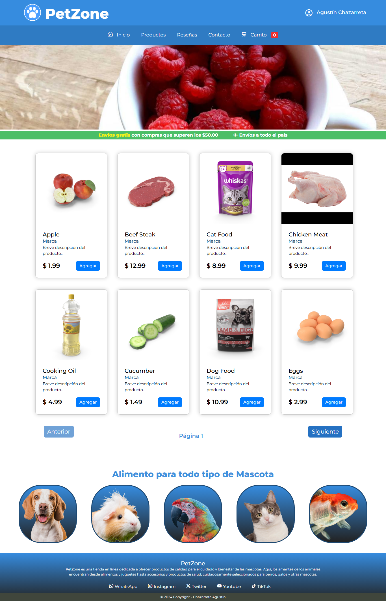

# 🐾 E-commerce "PetZone"

## Contenido
- [🐾 E-commerce "PetZone"](#-e-commerce-petzone)
  - [Contenido](#contenido)
  - [Descripción del Proyecto](#descripción-del-proyecto)
    - [Características Principales](#características-principales)
    - [📷 Screenshot](#-screenshot)
    - [🌐 Demo Online](#-demo-online)
  - [📂 Desarrollo del Proyecto](#-desarrollo-del-proyecto)
    - [🛠️ Tecnologías Utilizadas](#️-tecnologías-utilizadas)
    - [📌 Desafíos Encontrados](#-desafíos-encontrados)
    - [🚀 Mejoras Futuras](#-mejoras-futuras)
    - [📚 Recursos Útiles](#-recursos-útiles)

## Descripción del Proyecto
Este proyecto consiste en una página web de e-commerce de alimento para mascotas, desarrollada como parte de un curso de Front-End. La página está estructurada con HTML semántico, utilizando etiquetas como header, main, y footer para organizar el contenido. El diseño visual se implementa mediante CSS, aprovechando Flexbox y Grid para un layout moderno y responsivo. Además, se utilizó JavaScript para manejar la funcionalidad del carrito de compras, permitiendo a los usuarios agregar, eliminar y modificar los productos en su carrito de forma dinámica.

### Características Principales
1. **Navegación por Productos:**
   - Una interfaz intuitiva para explorar productos de diferentes categorías relacionadas con el cuidado de mascotas.
2. **Sección de Contacto:** 
   - Un formulario para consultas y solicitudes de información.
3. **Reseñas de Clientes:**
   - Testimonios de usuarios para añadir credibilidad y una experiencia más personalizada.
4. **Adaptabilidad y Diseño Responsive:**
   - El sitio incorpora media queries para implementar un diseño responsive, permitiendo una visualización óptima en dispositivos variados, desde monitores de PC hasta pantallas de celulares. La estructura y el diseño se ajustan automáticamente para ofrecer una experiencia de usuario coherente y fluida.

### 📷 Screenshot

### 🌐 Demo Online

Podés explorar el proyecto en **[GitHub Pages](https://agustinchazarreta.github.io/Ecommerce-PetZone-/)**.

## 📂 Desarrollo del Proyecto

### 🛠️ Tecnologías Utilizadas

- **HTML5:** Para estructurar el contenido de forma semántica y accesible.
- **CSS3:** Usando Flexbox, Grid y Bootstrap para diseñar el layout responsivo.
- **JavaScript:** Para manejar la funcionalidad dinámica del carrito de compras y la interacción del usuario.
- **Bootstrap:** Para la creación del navbar y algunos botones, facilitando un diseño atractivo y funcional.
- **GitHub Pages:** Para alojar y compartir el proyecto de forma pública.

### 📌 Desafíos Encontrados

- **Gestión del carrito de compras:** Implementar la lógica para agregar y eliminar productos dinámicamente, asegurando que los datos se reflejen correctamente en el DOM.
- **Diseño responsive:** Adaptar correctamente el diseño del sitio para distintos dispositivos y tamaños de pantalla, asegurando una experiencia consistente.
- **Optimización de código:** Mejorar el rendimiento y reducir redundancias en el CSS y JavaScript.

### 🚀 Mejoras Futuras

1. **Sistema de autenticación:** Incorporar un sistema para que los usuarios puedan registrarse e iniciar sesión.
2. **Base de datos:** Conectar el proyecto a una base de datos para almacenar productos, usuarios y pedidos.
3. **Pasarela de pagos:** Integrar servicios como PayPal o Mercado Pago para procesar pagos directamente desde la página.
4. **Más filtros de búsqueda:** Implementar opciones de búsqueda avanzadas para encontrar productos más rápido.

### 📚 Recursos Útiles

- **[MDN Web Docs](https://developer.mozilla.org):** Referencia para HTML, CSS y JavaScript.
- **[Flexbox Froggy](https://flexboxfroggy.com/):** Herramienta interactiva para aprender Flexbox.
- **[CSS-Tricks](https://css-tricks.com/):** Guías y consejos para diseño web.
- **[Bootstrap Docs](https://getbootstrap.com/docs/):** Referencia oficial para implementar componentes de Bootstrap.